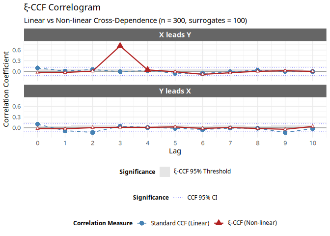
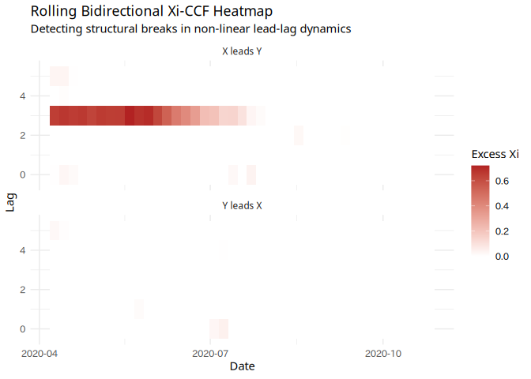
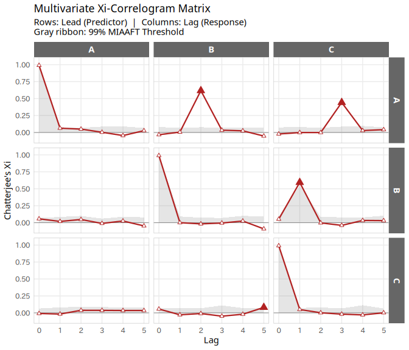

<!-- README.md is generated from README.Rmd. Please edit that file -->

# xiacf: Chatterjee’s Rank Correlation for Time Series Analysis

<!-- badges: start -->

[](https://CRAN.R-project.org/package=xiacf)
[](https://github.com/yetanothersu/xiacf/actions/workflows/R-CMD-check.yaml)
[](https://opensource.org/licenses/MIT)
[](https://doi.org/10.5281/zenodo.19247735)
<!-- badges: end -->

The **xiacf** package provides a robust framework for detecting complex
non-linear and functional dependence in time series data. Traditional
linear metrics, such as the standard Autocorrelation Function (ACF) and
Cross-Correlation Function (CCF), often fail to detect symmetrical or
purely non-linear relationships.

This package overcomes these limitations by utilizing **Chatterjee’s
Rank Correlation ($\xi$)**, offering both univariate ($\xi$-ACF) and
multivariate ($\xi$-CCF) analysis tools. It features rigorous
statistical hypothesis testing powered by advanced surrogate data
generation algorithms (IAAFT and MIAAFT), all implemented in
high-performance C++ using `RcppArmadillo`.

## Key Features

- **Non-linear Autocorrelation ($\xi$-ACF):** Detect time-dependent
  structures that standard linear ACF completely misses (e.g., chaotic
  systems, volatility clustering).
- **Multivariate Cross-Correlation ($\xi$-CCF):** Uncover hidden
  non-linear lead-lag relationships between two different time series.
- **MIAAFT Surrogate Testing:** Rigorous null hypothesis testing using
  Multivariate Iterative Amplitude Adjusted Fourier Transform (MIAAFT).
  It preserves the exact marginal distributions and the instantaneous
  (lag-0) cross-correlation while destroying lagged non-linear
  dependence.
- **Rolling Window Analysis:** Track how non-linear dependencies evolve
  over time (detecting structural breaks or market regime shifts) with
  robust parallel processing support via the `future` ecosystem.
- **High Performance:** Core algorithms are heavily optimized in C++ to
  handle the computationally intensive surrogate iterations.

## Installation

You can install the development version of xiacf from
[GitHub](https://github.com/) with:

``` r
# install.packages("remotes")
remotes::install_github("yetanothersu/xiacf")
```

*(Note: CRAN submission is currently pending. Once accepted, you can
install it via `install.packages("xiacf")`)*

## Quick Start

Here is a basic example showing how to compute and visualize the
$\xi$-ACF against a standard linear ACF.

``` r
library(xiacf)
library(ggplot2)

# Generate a chaotic Logistic Map: x_{t+1} = r * x_t * (1 - x_t)
set.seed(42)
n <- 500
x <- numeric(n)
x[1] <- 0.1 # Initial condition
r <- 4.0 # Fully chaotic regime

for (t in 1:(n - 1)) {
  x[t + 1] <- r * x[t] * (1 - x[t])
}

# 1. Run the Xi-ACF test
# Computes up to 20 lags with 100 IAAFT surrogates for significance testing
results <- xi_acf(x, max_lag = 20, n_surr = 100)

# Print summary
print(results)
#> 
#>  Chatterjee's Xi-ACF Test
#> 
#> Data length:   500 
#> Max lag:       20 
#> Significance: 95% (IAAFT, n_surr = 100)
#> 
#>  Lag          ACF           Xi Xi_Threshold  Xi_Excess
#>    1 -0.094245571  0.988012048   0.04806988 0.93994217
#>    2 -0.002595258  0.976036580   0.04447587 0.93156071
#>    3  0.022361912  0.952317334   0.04603879 0.90627854
#>    4  0.014398212  0.906530090   0.05262789 0.85390220
#>    5 -0.031941140  0.820703278   0.05262117 0.76808211
#>    6 -0.058549287  0.668178745   0.05728133 0.61089741
#>    7 -0.011438562  0.448874296   0.04287672 0.40599758
#>    8  0.005621485  0.211267315   0.03568038 0.17558693
#>    9 -0.060470919  0.102974116   0.03770035 0.06527377
#>   10  0.022159076 -0.016568166   0.03604263 0.00000000
#>   11 -0.045376715  0.032226497   0.05170479 0.00000000
#>   12 -0.072209612  0.030120558   0.04698102 0.00000000
#>   13  0.007066940  0.001429367   0.04629756 0.00000000
#>   14 -0.010218697  0.021486484   0.04490209 0.00000000
#>   15 -0.050879955  0.017715029   0.05063131 0.00000000
#>   16  0.013980615 -0.003368124   0.05575847 0.00000000
#>   17 -0.001535158  0.007055657   0.04938831 0.00000000
#>   18 -0.002734892 -0.040056301   0.04835100 0.00000000
#>   19 -0.004490956  0.001244813   0.04317233 0.00000000
#>   20  0.030634877 -0.012256998   0.04423478 0.00000000

# 2. Visualize the results
# The autoplot method automatically generates a ggplot2 object.
# Statistically significant lags (exceeding the dynamic threshold) are
# automatically highlighted with filled red triangles!
autoplot(results)
```

<div class="figure">


<p class="caption">
Comparison between standard linear ACF and Chatterjee’s Xi-ACF.
</p>

</div>

## Bidirectional $\xi$-CCF Test (Directional Lead-Lag Analysis)

While the standard CCF is symmetric in its linear evaluation, `xi_ccf()`
evaluates the **directional** non-linear lead-lag relationship. By
default (`bidirectional = TRUE`), it computes both “$X$ leads $Y$” and
“$Y$ leads $X$” simultaneously. Thanks to our optimized C++ engine, the
reverse direction is computed essentially at zero additional cost by
reusing the MIAAFT surrogates.

``` r
# Generate a pure non-linear lead-lag relationship
# Y is driven by the absolute value of X from 3 periods ago.
set.seed(42)
n <- 300
# A uniform distribution centered at 0 ensures the linear cross-correlation is zero
X <- runif(n, min = -2, max = 2)
Y <- numeric(n)

for (t in 4:n) {
  Y[t] <- abs(X[t - 3]) + rnorm(1, sd = 0.2)
}

# Run the bidirectional Xi-CCF test
ccf_results <- xi_ccf(x = X, y = Y, max_lag = 10, n_surr = 100)

# Visualize the results
# The new autoplot generates a beautiful 2-panel graph showing directional dependence.
# Standard CCF misses the V-shaped relationship, but Xi-CCF correctly detects that X leads Y by 3 periods.

autoplot(ccf_results)
```



## Rolling Window Analysis

For advanced market microstructure or structural break detection, you
can run rolling $\xi$-ACF or $\xi$-CCF analyses. These functions support
robust parallel processing via the `future` ecosystem and seamlessly
integrate with timestamps for intuitive visualization.

``` r
library(ggplot2)

# Generate dummy time series data with a structural break
set.seed(123)
dates <- seq(as.Date("2020-01-01"), by = "1 day", length.out = 300)
X <- rnorm(300)
Y <- numeric(300)

# First half (Day 1-150): X leads Y by 3 days (non-linear relationship)
Y[1:150] <- c(rnorm(3), abs(X[1:147])) + rnorm(150, sd = 0.1)
# Second half (Day 151-300): The relationship breaks down (pure noise)
Y[151:300] <- rnorm(150)

# Run rolling bidirectional Xi-CCF with time_index
rolling_res <- run_rolling_xi_ccf(
  x = X,
  y = Y,
  time_index = dates, # Pass the dates directly!
  window_size = 100,
  step_size = 5,
  max_lag = 5,
  n_surr = 50,
  n_cores = 2 # Set to NULL for sequential execution
)

# Visualize the dynamic relationship as a beautiful heatmap
ggplot(rolling_res, aes(x = Window_End_Time, y = Lag, fill = Xi_Excess)) +
  geom_tile() +
  scale_fill_gradient2(low = "white", high = "firebrick", mid = "white", midpoint = 0) +
  facet_wrap(~Direction, ncol = 1) +
  scale_x_date(date_labels = "%Y-%m") +
  labs(
    title = "Rolling Bidirectional Xi-CCF Heatmap",
    subtitle = "Detecting structural breaks in non-linear lead-lag dynamics",
    x = "Date",
    fill = "Excess Xi"
  ) +
  theme_minimal()
```



## Multivariate Network Analysis: `xi_matrix()`

For datasets with more than two variables, computing pairwise
relationships one by one is computationally expensive due to the
combinatorial explosion of surrogate generation.

In `v0.3.x`, we introduced `xi_matrix()`, which leverages an
**n-dimensional MIAAFT C++ engine** to compute all directional
relationships simultaneously. It generates the multivariate surrogate
matrix *only once* per iteration, allowing for blazing-fast network
causal discovery.

Let’s test it on a simulated non-linear causal chain
($A \to B \to C$): 1. **A**: Independent noise 2. **B**: Depends on the
**square** of A from 2 steps ago. 3. **C**: Depends on the **absolute
value** of B from 1 step ago.

``` r
# Generate a chain of non-linear causality
set.seed(42)
n <- 300
A <- runif(n, min = -2, max = 2)
B <- numeric(n)
C <- numeric(n)

for (t in 1:n) {
  if (t >= 3) B[t] <- A[t - 2]^2 + rnorm(1, sd = 0.5)
  if (t >= 2) C[t] <- abs(B[t - 1]) + rnorm(1, sd = 0.5)
}

df_network <- data.frame(A, B, C)

# Compute the multivariate Xi-correlogram matrix (99% confidence level)
res_matrix <- xi_matrix(df_network, max_lag = 5, n_surr = 100, sig_level = 0.99)
```

You can visualize the entire network of causal relationships, including
the direct links ($A \to B$, $B \to C$) and the indirect ripple effect
($A \to C$ at Lag 3), using the elegant `autoplot` method.

``` r
# The plot will automatically highlight significant points with filled red triangles!
autoplot(res_matrix)
```



## References

- Chatterjee, S. (2021). A new coefficient of correlation. *Journal of
  the American Statistical Association*, 116(536), 2009-2022.

## License

This project is licensed under the MIT License - see the LICENSE file
for details.
