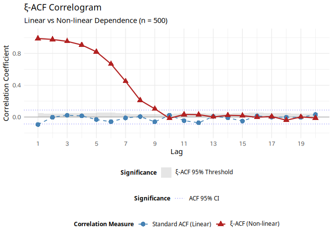
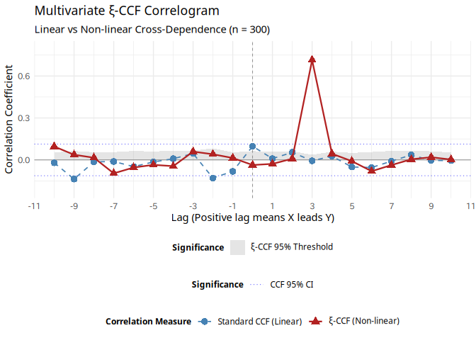

<!-- README.md is generated from README.Rmd. Please edit that file -->

# xiacf: Chatterjee’s Rank Correlation for Time Series Analysis

<!-- badges: start -->

[](https://CRAN.R-project.org/package=xiacf)
[](https://github.com/yetanothersu/xiacf/actions/workflows/R-CMD-check.yaml)
[](https://opensource.org/licenses/MIT)
[](https://doi.org/10.5281/zenodo.19247735)
<!-- badges: end -->

The **xiacf** package provides a robust framework for detecting complex
non-linear and functional dependence in time series data. Traditional
linear metrics, such as the standard Autocorrelation Function (ACF) and
Cross-Correlation Function (CCF), often fail to detect symmetrical or
purely non-linear relationships.

This package overcomes these limitations by utilizing **Chatterjee’s
Rank Correlation ($\xi$)**, offering both univariate ($\xi$-ACF) and
multivariate ($\xi$-CCF) analysis tools. It features rigorous
statistical hypothesis testing powered by advanced surrogate data
generation algorithms (IAAFT and MIAAFT), all implemented in
high-performance C++ using `RcppArmadillo`.

## Key Features

- **Non-linear Autocorrelation ($\xi$-ACF):** Detect time-dependent
  structures that standard linear ACF completely misses (e.g., chaotic
  systems, volatility clustering).
- **Multivariate Cross-Correlation ($\xi$-CCF):** Uncover hidden
  non-linear lead-lag relationships between two different time series.
- **MIAAFT Surrogate Testing:** Rigorous null hypothesis testing using
  Multivariate Iterative Amplitude Adjusted Fourier Transform (MIAAFT).
  It preserves the exact marginal distributions and the instantaneous
  (lag-0) cross-correlation while destroying lagged non-linear
  dependence.
- **Rolling Window Analysis:** Track how non-linear dependencies evolve
  over time (detecting structural breaks or market regime shifts) with
  robust parallel processing support via the `future` ecosystem.
- **High Performance:** Core algorithms are heavily optimized in C++ to
  handle the computationally intensive surrogate iterations.

## Installation

You can install the development version of xiacf from
[GitHub](https://github.com/) with:

``` r
# install.packages("remotes")
remotes::install_github("yetanothersu/xiacf")
```

*(Note: CRAN submission is currently pending. Once accepted, you can
install it via `install.packages("xiacf")`)*

## Quick Start

Here is a basic example showing how to compute and visualize the
$\xi$-ACF against a standard linear ACF.

``` r
library(xiacf)
library(ggplot2)

# Generate a chaotic Logistic Map: x_{t+1} = r * x_t * (1 - x_t)
set.seed(42)
n <- 500
x <- numeric(n)
x[1] <- 0.1 # Initial condition
r <- 4.0 # Fully chaotic regime

for (t in 1:(n - 1)) {
  x[t + 1] <- r * x[t] * (1 - x[t])
}

# 1. Run the Xi-ACF test
# Computes up to 20 lags with 100 IAAFT surrogates for significance testing
results <- xi_test(x, max_lag = 20, n_surr = 100)
#> Warning in xi_test(x, max_lag = 20, n_surr = 100): `xi_test()` is deprecated
#> and will be removed in a future version. Please use `xi_acf()` instead.

# Print summary
print(results)
#> 
#>  Chatterjee's Xi-ACF Test
#> 
#> Data length:   500 
#> Max lag:       20 
#> Surrogates:    100  (IAAFT)
#> 
#>  Lag          ACF           Xi Xi_Threshold_95
#>    1 -0.094245571  0.988012048      0.04806988
#>    2 -0.002595258  0.976036580      0.04447587
#>    3  0.022361912  0.952317334      0.04603879
#>    4  0.014398212  0.906530090      0.05262789
#>    5 -0.031941140  0.820703278      0.05262117
#>    6 -0.058549287  0.668178745      0.05728133
#>    7 -0.011438562  0.448874296      0.04287672
#>    8  0.005621485  0.211267315      0.03568038
#>    9 -0.060470919  0.102974116      0.03770035
#>   10  0.022159076 -0.016568166      0.03604263
#>   11 -0.045376715  0.032226497      0.05170479
#>   12 -0.072209612  0.030120558      0.04698102
#>   13  0.007066940  0.001429367      0.04629756
#>   14 -0.010218697  0.021486484      0.04490209
#>   15 -0.050879955  0.017715029      0.05063131
#>   16  0.013980615 -0.003368124      0.05575847
#>   17 -0.001535158  0.007055657      0.04938831
#>   18 -0.002734892 -0.040056301      0.04835100
#>   19 -0.004490956  0.001244813      0.04317233
#>   20  0.030634877 -0.012256998      0.04423478

# 2. Visualize the results
# The autoplot method automatically generates a ggplot2 object
autoplot(results)
```

<div class="figure">


<p class="caption">
Comparison between standard linear ACF and Chatterjee’s Xi-ACF.
</p>

</div>

## Multivariate Cross-Correlation ($\xi$-CCF)

The package supports multivariate analysis to detect non-linear lead-lag
relationships between two time series. It uses MIAAFT surrogates to
preserve both the individual distributions and the lag-0
cross-correlation, providing a rigorous threshold for significance.

The following example demonstrates a scenario where the standard CCF
completely fails to detect the relationship, but $\xi$-CCF correctly
identifies the lead-lag structure.

``` r
# Generate a pure non-linear lead-lag relationship
# Y is driven by the absolute value of X from 3 periods ago.
set.seed(42)
n <- 300
# A uniform distribution centered at 0 ensures the linear cross-correlation is zero
X <- runif(n, min = -2, max = 2)
Y <- numeric(n)

for (t in 4:n) {
  Y[t] <- abs(X[t - 3]) + rnorm(1, sd = 0.2)
}

# Run the multivariate Xi-CCF test
ccf_results <- xi_ccf(x = X, y = Y, max_lag = 10, n_surr = 100)

# Visualize the results
# Standard CCF misses the V-shaped relationship, but Xi-CCF correctly detects that X leads Y by 3 periods.
autoplot(ccf_results)
```

<div class="figure">


<p class="caption">
Multivariate Xi-CCF detecting a purely non-linear lead-lag relationship.
</p>

</div>

## Rolling Window Analysis

For advanced market microstructure or structural break detection, you
can run a rolling $\xi$-ACF analysis. This function supports parallel
processing using the `future` ecosystem.

``` r
# Run rolling analysis with a window size of 100 and step size of 10
rolling_res <- run_rolling_xi_analysis(
  x = x,
  window_size = 100,
  step_size = 10,
  max_lag = 5,
  n_surr = 50,
  n_cores = 2 # Set to NULL for sequential execution
)

head(rolling_res)
#>   Window_ID Window_Start_Idx Window_End_Idx Lag Xi_Original Xi_Threshold_95
#> 1         1                1            100   1   0.9403061       0.1204643
#> 2         1                1            100   2   0.8819119       0.1163074
#> 3         1                1            100   3   0.7720026       0.1081154
#> 4         1                1            100   4   0.5930548       0.1042485
#> 5         1                1            100   5   0.3085106       0.1070479
#> 6         2               11            110   1   0.9403061       0.1103010
#>   Xi_Excess
#> 1 0.8198418
#> 2 0.7656045
#> 3 0.6638871
#> 4 0.4888063
#> 5 0.2014628
#> 6 0.8300051
```

## References

- Chatterjee, S. (2021). A new coefficient of correlation. *Journal of
  the American Statistical Association*, 116(536), 2009-2022.

## License

This project is licensed under the MIT License - see the LICENSE file
for details.
