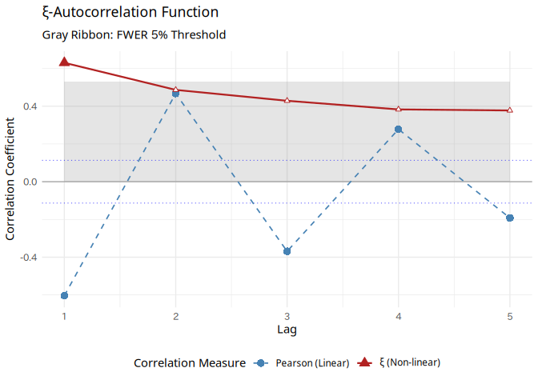
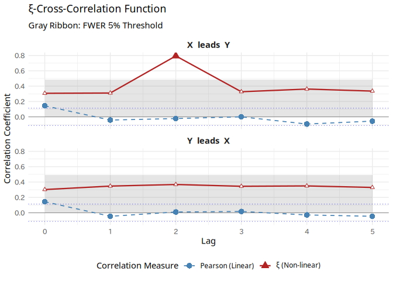
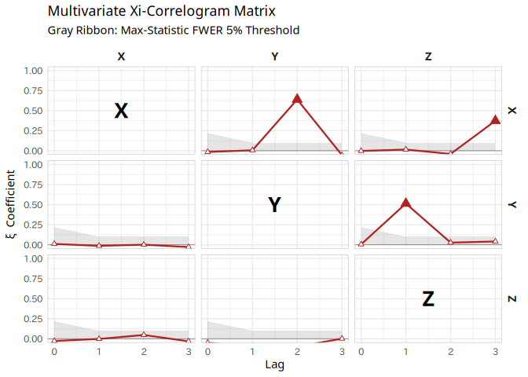
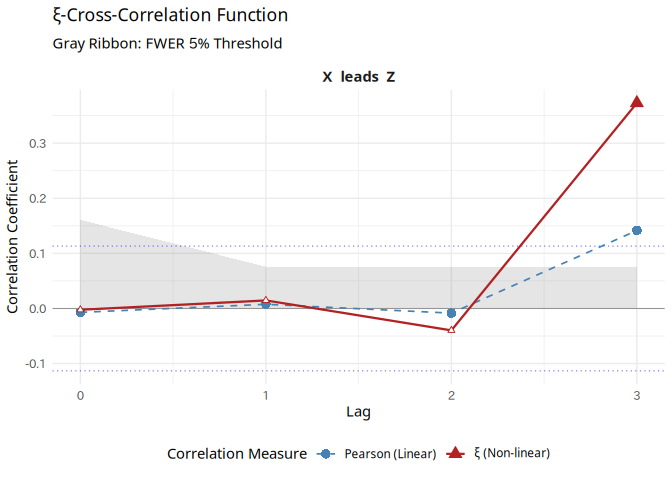

# xiacf: Nonlinear Dependence and Lead-Lag Analysis via Chatterjee’s Xi

[](https://CRAN.R-project.org/package=xiacf)
[](https://github.com/yetanothersu/xiacf/actions/workflows/R-CMD-check.yaml)
[](https://opensource.org/licenses/MIT)
[](https://doi.org/10.5281/zenodo.19247735)

## Introduction

The **xiacf** package provides a robust framework for detecting complex
non-linear and functional dependence in time series data. Traditional
linear metrics, such as the standard Autocorrelation Function (ACF) and
Cross-Correlation Function (CCF), often fail to detect symmetrical or
purely non-linear relationships.

This package overcomes these limitations by utilizing **Chatterjee’s
Rank Correlation ($\xi$)**, offering both univariate ($\xi$-ACF) and
multivariate ($\xi$-CCF) analysis tools. It features rigorous
statistical hypothesis testing powered by advanced surrogate data
generation algorithms (IAAFT and MIAAFT) and dynamic Family-Wise Error
Rate (FWER) control, all implemented in high-performance C++ using
`RcppArmadillo`.

## Citation

If you use `xiacf` in your research, please cite our latest working
paper detailing the methodology:

> Watanabe, Y. (2026). Differential diagnosis of nonlinearity:
> Integrating the BDS omnibus test with chatterjee’s xi for local
> structural identification. In Social Science Research Network.
> <https://doi.org/10.2139/ssrn.6829431>

## Key Features

- **Non-linear Autocorrelation ($\xi$-ACF):** Detect time-dependent
  structures that standard linear ACF completely misses, such as chaotic
  systems or volatility clustering (e.g., $X_t = |X_{t-1}|$).
- **Directional Cross-Correlation ($\xi$-CCF):** Uncover asymmetrical
  causal pathways. The metric clearly separates causal directions
  (`X leads Y` vs `Y leads X`) and captures contemporaneous effects
  (Lag 0) where traditional Pearson CCF fails.
- **Multivariate Network Matrix (`xi_matrix`):** Simultaneously evaluate
  causal pathways across an entire system of time series to build
  directed non-linear networks.
- **Rigorous Inference & Dual-Family FWER Control:** Utilizes
  phase-randomized surrogate data (IAAFT / MIAAFT) and dynamically
  controls the FWER via Max-Statistic distributions. To overcome the
  **“Lag-0 Masking Effect”**—where MIAAFT perfectly preserves
  contemporaneous linear confounding—`xiacf` uniquely implements a
  **Dual-Family FWER Control**. It completely decouples the significance
  thresholds for pure contemporaneous effects (Lag 0) and temporal
  causal propagation (Lag \> 0), maximizing the statistical power to
  detect delayed causal spillovers.
- **Strict Algorithmic Integrity:** The core C++ engine rigorously
  implements the exact original specifications of Chatterjee’s $\xi$. By
  enforcing uniform random tie-breaking, the package ensures that the
  baseline calculations strictly align with the mathematical definition
  and its asymptotic properties.
- **Tidyverse-ready & Publication-Quality UI:** All functions return
  Tidy data frames. The `autoplot()` methods instantly generate
  beautiful, unified, and publication-ready `ggplot2` visualizations.
- **High-Performance Rolling Analysis:** Fully parallelized (via
  `doFuture`) rolling window functions to capture time-varying
  dependencies smoothly and efficiently.

## Installation

You can install the stable version of xiacf from CRAN with:

``` r
install.packages("xiacf")
```

You can install the development version from
[GitHub](https://github.com/yetanothersu/xiacf) with:

``` r
# install.packages("remotes")
remotes::install_github("yetanothersu/xiacf")
```

## Basic Usage

### 1. Univariate Non-linear ACF ($\xi$-ACF)

Detecting strong non-linear auto-dependence that standard linear ACF
fails to capture.

``` r
### 1. Univariate Non-linear ACF (xi-ACF)

library(xiacf)
library(ggplot2)

set.seed(42)
n <- 300

# Generate a series with V-shaped auto-dependence (mean zero)
# Standard Pearson ACF will miss this, but Xi-ACF will detect it.
A <- numeric(n)
A[1] <- rnorm(1)
for (t in 2:n) {
  # Subtracting 0.8 keeps the series centered around 0
  A[t] <- abs(A[t - 1]) - 0.8 + rnorm(1, sd = 0.2)
}

res_acf <- xi_acf(A, max_lag = 5, n_surr = 249)
#> Warning in check_surrogate_count(n_surr = n_surr, sig_level = sig_level, : For
#> 5 simultaneous tests at sig_level = 0.05, the empirical distribution of the
#> max-statistic may be unstable with n_surr = 249. Recommended n_surr is at least
#> 399.
print(res_acf)
#> 
#> === Univariate Xi-Autocorrelation Function ===
#> Time series length: 300
#> Max Lag: 5
#> Surrogates (IAAFT): 249
#> Significance Level: 0.05 (FWER controlled)
#> ==============================================
#> Significant Lags:
#>  Lag        Xi Global_Threshold Xi_Excess
#>    1 0.4470805        0.2976711 0.1494094
autoplot(res_acf)
```



### 2. Bivariate Non-linear CCF ($\xi$-CCF)

Discovering hidden causal pathways across different time series.

``` r
### 2. Bivariate Non-linear CCF (xi-CCF)

# X is pure noise (mean 0, symmetric)
X <- rnorm(n)
Y <- numeric(n)

# Y is a purely quadratic function of X at lag 2
for (t in 3:n) {
  Y[t] <- X[t - 2]^2 + rnorm(1, sd = 0.2)
}

# Center Y so it contains both negative and positive values.
# Without this, Y is always positive, making abs(Y) purely linear later!
Y <- as.numeric(scale(Y))

res_ccf <- xi_ccf(X, Y, max_lag = 5, n_surr = 249, direction = "both")
#> Warning in check_surrogate_count(n_surr = n_surr, sig_level = sig_level, : For
#> 10 simultaneous tests at sig_level = 0.05, the empirical distribution of the
#> max-statistic may be unstable with n_surr = 249. Recommended n_surr is at least
#> 399.
print(res_ccf)
#> 
#> === Bivariate Xi-Cross-Correlation (CCF) ===
#> Variables: X, Y
#> Time series length: 300
#> Max Lag: 5
#> Direction: both
#> Surrogates (MIAAFT): 249
#> Significance Level: 0.05 (FWER controlled)
#> ============================================
#> Top 5 Strongest Causal Pathways:
#>  Lead_Var Lag_Var Lag        Xi      CCF Global_Threshold Xi_Excess
#>         X       Y   2 0.6388298 0.123921       0.09151595 0.5473138
autoplot(res_ccf)
```



### 3. Multivariate Network Matrix

Analyze an entire system of variables at once.

``` r
### 3. Multivariate Network Matrix & Pathway Extraction

Z <- numeric(n)

# Z depends on the absolute value of Y at lag 1
# Because Y is centered, this creates a true V-shaped non-linear relationship
for (t in 2:n) {
  Z[t] <- abs(Y[t - 1]) + rnorm(1, sd = 0.2)
}
Z <- as.numeric(scale(Z))

df_system <- data.frame(X = X, Y = Y, Z = Z)

# Compute the multivariate Xi-correlogram matrix
res_matrix <- xi_matrix(df_system, max_lag = 3, n_surr = 499)

autoplot(res_matrix)
```



``` r

# Extract it for a detailed bivariate analysis with exact FWER re-evaluation!
ext_ccf <- extract_xi_ccf(res_matrix, var_x = "X", var_y = "Z", direction = "x_leads")
autoplot(ext_ccf)
```



### 4. Rolling Analysis for Dynamic Relationships

Extract time-varying non-linear dependencies. The output is a Tidy data
frame, perfectly structured for custom EDA and visualization.

``` r
### 4. Rolling Analysis for Dynamic Relationships

library(future)
plan(multisession) # or multicore on Linux/macOS

rolling_res <- run_rolling_xi_ccf(
  x = X,
  y = Y,
  window_size = 50,
  step_size = 10,
  max_lag = 3,
  n_surr = 199
)

head(rolling_res)
#>   Window_ID Lead_Var Lag_Var Lag          Xi Global_Threshold Xi_Excess
#> 1         1        x       y   0 -0.03601441        0.2570228 0.0000000
#> 2         1        x       y   1 -0.04625000        0.2185806 0.0000000
#> 3         1        x       y   2  0.54798089        0.2185806 0.3294003
#> 4         1        x       y   3 -0.06657609        0.2185806 0.0000000
#> 5         1        y       x   0 -0.07803121        0.2570228 0.0000000
#> 6         1        y       x   1  0.00125000        0.2185806 0.0000000
```

## References

The theoretical foundation and surrogate data methodologies implemented
in this package are based on the following works:

- **Chatterjee’s $\xi$:** Chatterjee, S. (2021). A new coefficient of
  correlation. *Journal of the American Statistical Association*,
  116(536), 2009-2022. <https://doi.org/10.1080/01621459.2020.1758115>
- **IAAFT / Surrogate Data:** Schreiber, T., & Schmitz, A. (1996).
  Improved surrogate data for nonlinearity tests. *Physical Review
  Letters*, 77(4), 635. <https://doi.org/10.1103/PhysRevLett.77.635>
- **Local Structural Identification (Package Methodology):**
  Watanabe, Y. (2026). Differential diagnosis of nonlinearity:
  Integrating the BDS omnibus test with chatterjee’s xi for local
  structural identification. *SSRN Preprint*.
  <https://doi.org/10.2139/ssrn.6829431>

## License

This project is licensed under the MIT License - see the LICENSE file
for details.
