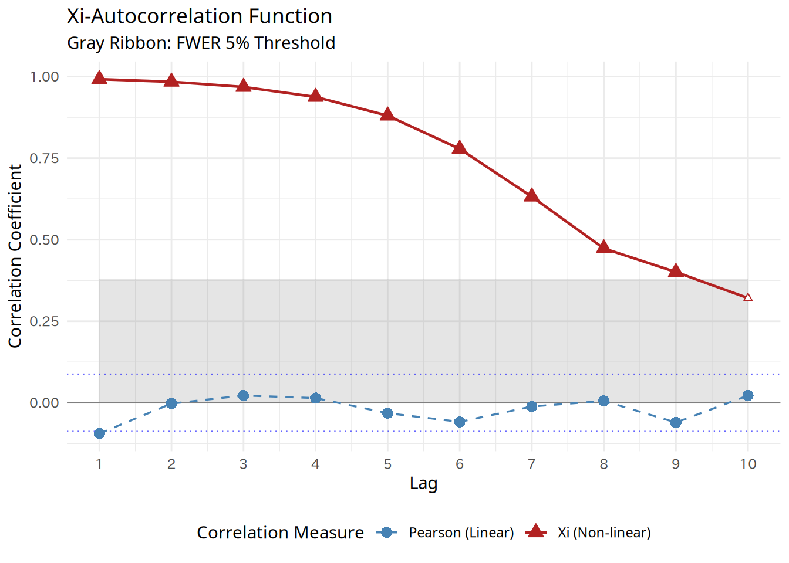
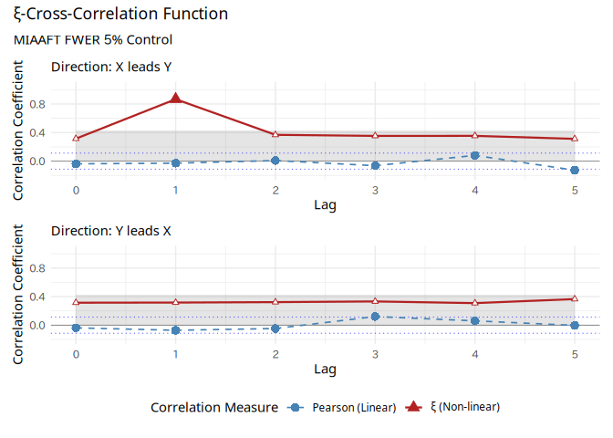
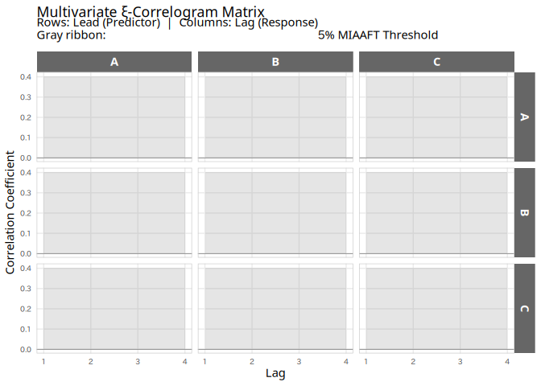
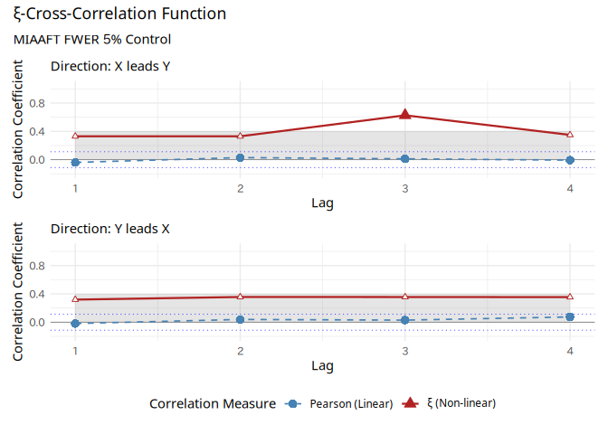
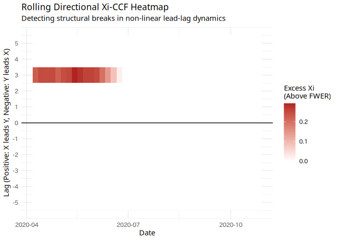

# xiacf: Nonlinear Dependence and Lead-Lag Analysis via Chatterjee’s Xi

[](https://CRAN.R-project.org/package=xiacf)
[](https://github.com/yetanothersu/xiacf/actions/workflows/R-CMD-check.yaml)
[](https://opensource.org/licenses/MIT)
[](https://doi.org/10.5281/zenodo.19247735) The **xiacf** package
provides a robust framework for detecting complex non-linear and
functional dependence in time series data. Traditional linear metrics,
such as the standard Autocorrelation Function (ACF) and
Cross-Correlation Function (CCF), often fail to detect symmetrical or
purely non-linear relationships.

This package overcomes these limitations by utilizing **Chatterjee’s
Rank Correlation ($\xi$)**, offering both univariate ($\xi$-ACF) and
multivariate ($\xi$-CCF) analysis tools. It features rigorous
statistical hypothesis testing powered by advanced surrogate data
generation algorithms (IAAFT and MIAAFT), all implemented in
high-performance C++ using `RcppArmadillo`.

## Key Features

- **Non-linear Autocorrelation ($\xi$-ACF):** Detect time-dependent
  structures that standard linear ACF completely misses (e.g., chaotic
  systems, volatility clustering).
- **Multivariate Cross-Correlation ($\xi$-CCF):** Uncover hidden
  non-linear lead-lag relationships between two different time series.
- **Strict FWER Control:** To prevent data snooping across multiple lags
  and variable pairs, `xiacf` strictly controls the Family-Wise Error
  Rate (FWER) using the Max-statistic approach. It provides a robust
  “Global Threshold” to confidently identify true non-linear dynamics.
- **MIAAFT Surrogate Testing:** Rigorous null hypothesis testing using
  Multivariate Iterative Amplitude Adjusted Fourier Transform (MIAAFT).
  It preserves the exact marginal distributions and the instantaneous
  (lag-0) linear cross-correlation while destroying lagged non-linear
  dependence.
- **High Performance C++ Engine:** Core algorithms are heavily optimized
  in C++ to handle computationally intensive surrogate iterations
  simultaneously across all lags and pairs.

## Installation

You can install the stable version of xiacf from CRAN with:

``` r
install.packages("xiacf")
```

You can install the development version from
[GitHub](https://github.com/yetanothersu/xiacf) with:

``` r
# install.packages("remotes")
remotes::install_github("yetanothersu/xiacf")
```

## Quick Start: Univariate $\xi$-ACF

Here is a basic example showing how to compute and visualize the
$\xi$-ACF against a standard linear ACF.

``` r
library(xiacf)
library(ggplot2)

# Generate a chaotic Logistic Map: x_{t+1} = r * x_t * (1 - x_t)
set.seed(42)
n <- 500
x <- numeric(n)
x[1] <- 0.1
r <- 4.0 # Fully chaotic regime

for (t in 1:(n - 1)) {
  x[t + 1] <- r * x[t] * (1 - x[t])
}

# 1. Run the Xi-ACF test
# Computes up to 10 lags. Default n_surr = 399 controls FWER at sig_level = 0.05.
results <- xi_acf(x, max_lag = 10)

# Print summary
print(results)
#> 
#> === Univariate Xi-Autocorrelation Function ===
#> Time series length: 500
#> Max Lag: 10
#> Surrogates (IAAFT): 399
#> Significance Level: 0.05 (FWER controlled)
#> ==============================================
#> Significant Lags:
#>  Lag        Xi Global_Threshold  Xi_Excess
#>    1 0.9919920        0.3812919 0.61070012
#>    2 0.9839923        0.3812919 0.60270041
#>    3 0.9681476        0.3812919 0.58685570
#>    4 0.9375611        0.3812919 0.55626920
#>    5 0.8802274        0.3812919 0.49893548
#>    6 0.7783380        0.3812919 0.39704613
#>    7 0.6318376        0.3812919 0.25054570
#>    8 0.4731095        0.3812919 0.09181757
#>    9 0.4007648        0.3812919 0.01947289

# 2. Visualize the results
# Significant non-linear lags (piercing the gray FWER ribbon) are highlighted
# with filled red triangles.
autoplot(results)
```

<div class="figure">


<p class="caption">
Comparison between standard linear ACF and Chatterjee’s Xi-ACF.
</p>

</div>

## Directional $\xi$-CCF Test (Lead-Lag Analysis)

While the standard CCF is symmetric in its linear evaluation, `xi_ccf()`
evaluates the **directional** non-linear lead-lag relationship. It
computes both “$X$ leads $Y$” and “$Y$ leads $X$” simultaneously.

``` r
# Generate a pure non-linear lead-lag relationship
# Y is driven by the square of X from 1 period ago.
set.seed(42)
n <- 300
X <- rnorm(n)
Y <- c(0, X[-n]^2) + rnorm(n, sd = 0.1)

# Run the directional Xi-CCF test
ccf_results <- xi_ccf(X, Y, max_lag = 5)

# Visualize the differential diagnosis
# Standard CCF (blue dashed line) misses the squared relationship, but Xi-CCF (red line)
# correctly detects that X leads Y by 1 period.
autoplot(ccf_results)
```



## Multivariate Network Analysis: `xi_matrix()`

For datasets with more than two variables, computing pairwise
relationships one by one is computationally expensive and inflates false
positives.

`xi_matrix()` leverages an **n-dimensional MIAAFT C++ engine** to
compute all directional relationships simultaneously. It generates the
multivariate surrogate matrix *only once* per iteration and strictly
controls the FWER across the entire network.

``` r
# Generate a chain of non-linear causality: A -> B -> C
set.seed(42)
n <- 300
A <- runif(n, min = -2, max = 2)
B <- numeric(n)
C <- numeric(n)

for (t in 1:n) {
  if (t >= 3) B[t] <- A[t - 2]^2 + rnorm(1, sd = 0.5)
  if (t >= 2) C[t] <- abs(B[t - 1]) + rnorm(1, sd = 0.5)
}

df_network <- data.frame(A, B, C)

# Compute the multivariate Xi-correlogram matrix
res_matrix <- xi_matrix(df_network, max_lag = 4, n_surr = 799)

# Plot the entire network of causal relationships
autoplot(res_matrix)
```



### Extracting Pairwise Relationships

Once the heavy matrix calculation is done, you can instantly extract
individual ACF or CCF objects for detailed inspection against linear
baselines without re-running the surrogates.

``` r
# Extract the relationship between A and C (Indirect effect)
# Passing the original data allows calculation of the standard linear CCF for comparison
ccf_A_C <- extract_xi_ccf(res_matrix, var_x = "A", var_y = "C", x_raw = df_network)
autoplot(ccf_A_C)
```



## Rolling Window Analysis

For advanced market microstructure or structural break detection, you
can run rolling analyses. The functions support robust parallel
processing via the `future` ecosystem and seamlessly integrate with
timestamps.

``` r
library(ggplot2)

# Generate dummy time series data with a structural break
set.seed(123)
dates <- seq(as.Date("2020-01-01"), by = "1 day", length.out = 300)
X <- rnorm(300)
Y <- numeric(300)

# First half (Day 1-150): X leads Y by 3 days (non-linear relationship)
Y[1:150] <- c(rnorm(3), abs(X[1:147])) + rnorm(150, sd = 0.1)
# Second half (Day 151-300): The relationship breaks down (pure noise)
Y[151:300] <- rnorm(150)

# Run rolling Xi-CCF with time_index
rolling_res <- run_rolling_xi_ccf(
  x = X,
  y = Y,
  time_index = dates,
  window_size = 100,
  step_size = 5,
  max_lag = 5,
  n_surr = 199, # Reduced for vignette speed
  n_cores = 2 # Set to NULL for sequential execution
)

# Visualize the dynamic relationship as a beautiful heatmap
ggplot(rolling_res, aes(x = Window_End_Time, y = Lag, fill = Xi_Excess)) +
  geom_tile() +
  scale_fill_gradient(low = "white", high = "firebrick") +
  geom_hline(yintercept = 0, color = "black", linewidth = 0.5) +
  scale_y_continuous(breaks = -5:5) +
  scale_x_date(date_labels = "%Y-%m") +
  labs(
    title = "Rolling Directional Xi-CCF Heatmap",
    subtitle = "Detecting structural breaks in non-linear lead-lag dynamics",
    x = "Date",
    y = "Lag (Positive: X leads Y, Negative: Y leads X)",
    fill = "Excess Xi\n(Above FWER)"
  ) +
  theme_minimal()
```



## References

- Chatterjee, S. (2021). A new coefficient of correlation. *Journal of
  the American Statistical Association*, 116(536), 2009-2022.

## License

This project is licensed under the MIT License - see the LICENSE file
for details.
